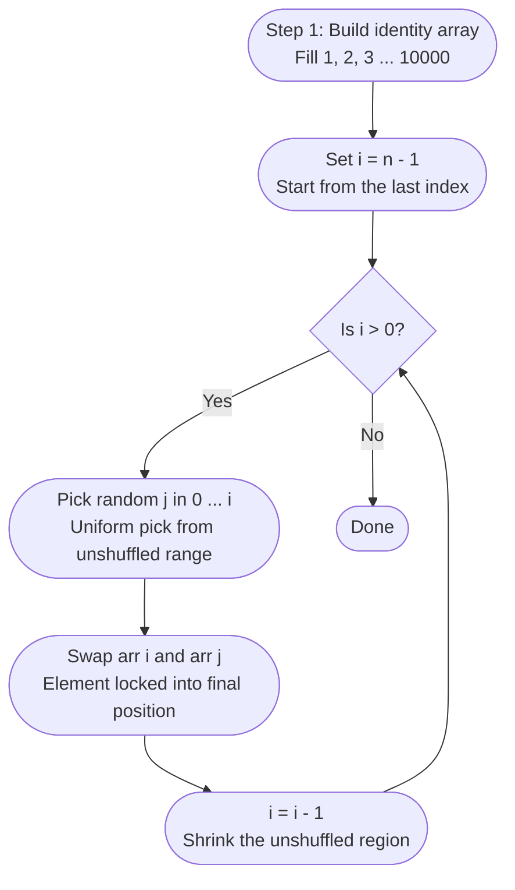

# RandomSequence

A C# console application that generates **10,000 unique integers (1–10,000) in a uniformly random order** each time it runs. Includes a companion MSTest unit-test project.

---

## Quick Start

**Requirements:** 
[.NET 8 SDK](https://dotnet.microsoft.com/en-us/download/dotnet/8.0)

```bash
# Run the console app
dotnet run --project RandomSequence/RandomSequence.csproj

# Run all unit tests
dotnet test RandomSequence.Test/RandomSequence.Test.csproj
```

Sample output:
```
=== Random Unique Sequence Generator ===
Generating 10,000 unique numbers in random order...

--- First 20 values ---
7431, 2198, 9054, 812, 3376, 6701, 245, 8893, 1102, 4967, ...

--- Last 20 values ---
..., 5540, 77, 3201, 6688, 9314, 421, 8057, 1993, 6124, 3882

Elapsed time    : 0.412 ms
```

---

## Project Structure

```
RandomSequence/
├── Program.cs                    # Entry point, preview output, timing
├── SequenceGenerator.cs          # Core algorithm (Fisher-Yates shuffle)
├── RandomSequence.csproj
RandomSequence.Tests/
├── SequenceGeneratorTests.cs
└── RandomSequence.Tests.csproj
```

---

## Algorithm — Fisher-Yates Shuffle

### Why Fisher-Yates?

The Fisher-Yates shuffle is the industry-standard algorithm for this problem. It runs in O(n) time, touching each element exactly once, and guarantees every possible ordering is equally likely with no duplicates possible by design. Simpler alternatives like sorting by a random key are slower and can introduce subtle bias. Rejection sampling degrades as the list fills up. Fisher-Yates has neither problem.

### How It Works


---

## Unit Tests

| Test | What it proves |
|---|---|
| `RandomNumberGeneratorTests_Generate10000Elements_ReturnsCorrectLength` | Correct output length |
| `RandomNumberGeneratorTests_Generate10000Elements_ContainsAllValues` | No missing values |
| `RandomNumberGeneratorTests_Generate10000Elements_NoDuplicates` | No repeated values |
| `RandomNumberGeneratorTests_TwoConsecutiveRuns_ProduceDifferentOrderings` | Different result each run |
| `RandomNumberGeneratorTests_Generate10000Elements_IsNotSortedAscending` | Array is actually shuffled |
| `RandomNumberGeneratorTests_SingleElement_ReturnsArrayOfOne` | Edge case: range of size 1 |
| `RandomNumberGeneratorTests_SmallRange_ContainsAllValues` | Small range correctness |
| `RandomNumberGeneratorTests_MinGreaterThanMax_ThrowsArgumentException` | Guard clause |
